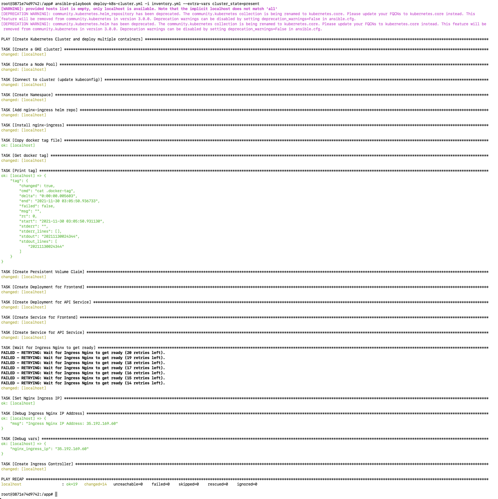
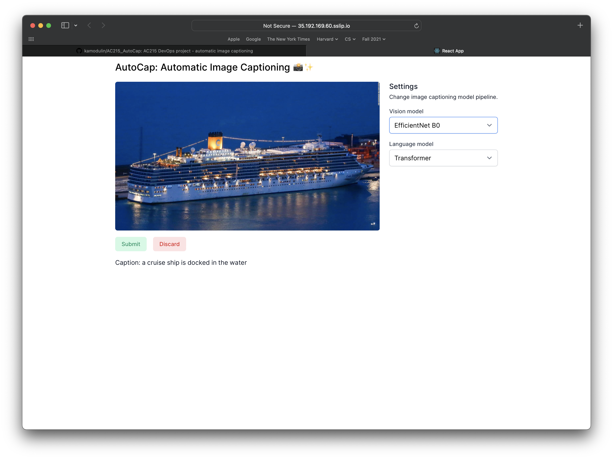

# Milestone 3 - Progress report, proof of concept, and updated project outline
Group: AutoCap

Project: Caption this image

## Team members
- Brendan O'Leary
- Luke Sagers
- James Parker
- Kamran Ahmed

> Our problem definition and proposed solution remain the same: we will create a web application to automatically generate image captions using a combination of computer vision and natural language processing models.

### Modeling
We have expanded on models presented in milestone 2 to increase captioning accuracy. Each combination of vision and language models were trained end-to-end.
- Vision models: EfficientNet B0, Inception V3, VGG16
- Language models: RNN with attention, Transformer

### Application
We created single-page application using a React frontend and a Flask API. We have included model settings where the user can select their preferred vision and language models. After the caption is generated, the user can hover over individual words to see which parts of the image the langauge model was focusing on as it generated the caption.

### App demo with the attention overlay for "field".

## Browser Extension
We have developed a Safari extension to automatically add alternative text to images. This only works locally currently. For production, we will have to configure HTTPS and change our API configuration to allow requests from all origins. We also plan to create a similar Chrome extension.

## Kubernetes Deployment
Scripts for [deployment](https://github.com/kamodulin/AC215_AutoCap/tree/master/deployment) are located at `AC215_AutoCap/deployment/scripts`. A live version of our app can be found at 35.192.169.60.sslip.io

### Screenshot of K8s deployment

### Screenshot of app deployed to GCP

## Miscellaneous
We have updated the README at the root of our repository to describe our components.

## Future directions
- We plan to purchase a domain name for our project and we need to enable HTTPS to allow our browser extension to work.